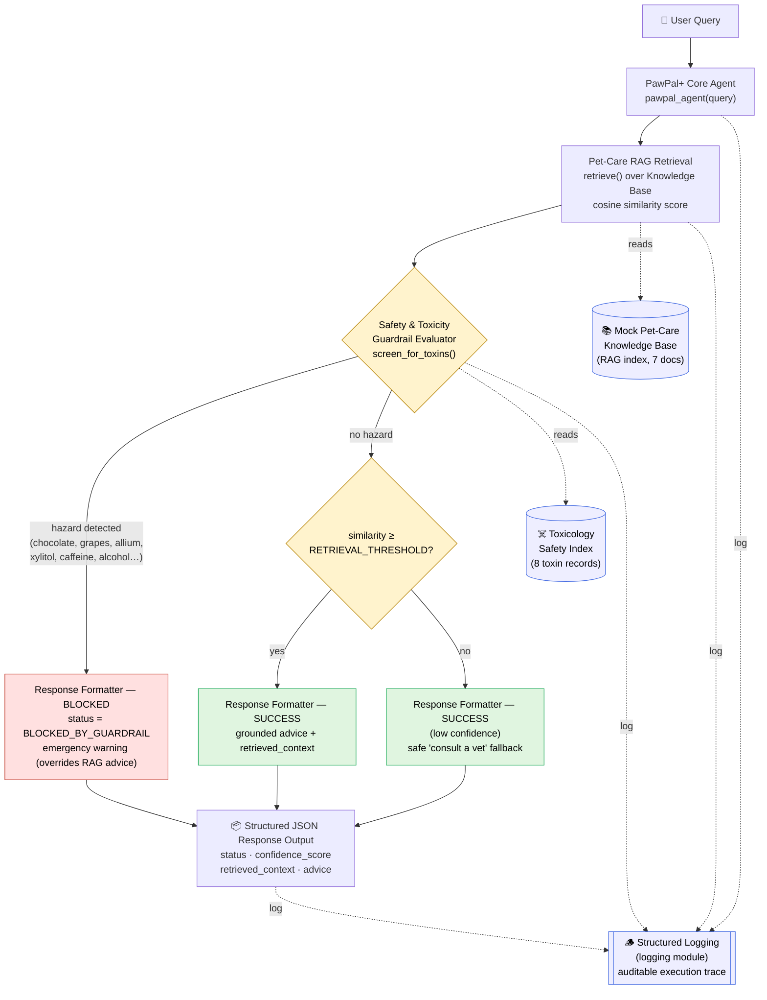

# PawPal+ — Applied AI System (RAG + Safety Guardrails)

**CodePath AI110 · Project 4: "Show What You Know: Applied AI System"**

An Applied-AI extension of the Module 2 project **PawPal+**. It adds a
retrieval-grounded pet-care advice agent with a safety-first toxicity
guardrail, structured logging, and reproducible execution evidence.

---

## 1. Base Project Summary

**Base project:** PawPal+ (CodePath AI110 **Module 2**).

PawPal+ started as a **Streamlit pet-care task scheduler**. Its original goal
was to help a busy pet owner stay consistent with care tasks (walks, feeding,
medication, grooming) by:

- modelling the domain with four classes — `Owner`, `Pet`, `Task`, `Scheduler`
  (see [pawpal_system.py](pawpal_system.py) and [uml.mmd](uml.mmd));
- **sorting** tasks chronologically, **filtering** by status/pet, and
  **detecting scheduling conflicts** (two tasks at the same time);
- exposing all of this through a Streamlit UI ([app.py](app.py)), backed by a
  21-test pytest suite ([tests/test_pawpal.py](tests/test_pawpal.py)).

Module 2 answered *"**when** should I do my pet-care tasks?"*

### From Module 2 → Applied AI System

Project 4 keeps that scheduling core untouched and adds an AI advice layer that
answers a different question: *"**what** should I do, and **is it safe?**"*

| | Module 2 (base) | Project 4 (Applied AI extension) |
|---|---|---|
| **Core question** | *When* to run care tasks | *What* care advice, and *is it safe?* |
| **Technique** | Object-oriented scheduling logic | **RAG** grounding + **safety guardrail** |
| **Entry point** | `schedule_demo.py` (CLI) / `app.py` (UI) | **`main.py`** — `pawpal_agent(query)` |
| **Output** | Sorted schedule + conflict report | Structured **JSON** (`status`, `confidence_score`, `retrieved_context`, `advice`) |
| **Safety** | — | Fail-closed **toxicity guardrail** (chocolate, grapes, xylitol, …) |
| **Observability** | `print()` | Structured **`logging`** execution trace |

> **Note on `main.py`:** the original Module 2 scheduling CLI demo was
> preserved as [schedule_demo.py](schedule_demo.py); the scheduling logic itself
> still lives untouched in [pawpal_system.py](pawpal_system.py). `main.py` is now
> the Applied AI System entry point.

---

## 2. Architecture Overview

Data flow (rubric sequence): **User Query → PawPal+ Core Agent → Pet-Care RAG
Retrieval → Safety Guardrail Evaluator → Response Output (Safe vs Blocked)**,
with **structured logging** across every stage. RAG retrieval runs first; the
guardrail then evaluates the query and, on a detected toxin, **overrides** the
retrieved advice (a **fail-closed** design) with an emergency warning.

Source: [diagrams/architecture.mmd](diagrams/architecture.mmd)



**Pipeline stages** (all in [main.py](main.py)):

1. **Pet-Care RAG Retrieval** — `retrieve()` scores the query against a
   7-document knowledge base using the **Otsuka–Ochiai cosine coefficient**
   (`|A ∩ B| / √(|A|·|B|)`) over bag-of-keyword sets, returning the best
   candidate document.
2. **Safety & Toxicity Guardrail Evaluator** — `screen_for_toxins()` evaluates
   the query against an 8-record toxicology index using word-boundary token
   matching. Any hit → **`BLOCKED_BY_GUARDRAIL`**: the guardrail overrides the
   retrieved advice with an emergency warning (the RAG candidate is preserved in
   `metadata` for auditability).
3. **Response Output** — if the guardrail clears, grounds advice in the
   retrieved document, or falls back to a safe "consult a vet" response if
   similarity is below `RETRIEVAL_THRESHOLD` (`0.15`). Always emits the
   structured JSON contract.
4. **Structured logging** — every stage logs an `event=… key=value` record.

---

## 3. Setup & Execution Instructions

**Requirements:** Python 3.10+ (developed on 3.14). `main.py` uses **only the
Python standard library** — no API keys, no network, no extra installs.

```bash
# 1. (Optional) create and activate a virtual environment
python -m venv .venv
source .venv/bin/activate        # Windows: .venv\Scripts\activate

# 2. (Optional) install the base project's Streamlit/pytest deps
pip install -r requirements.txt

# 3. Run the Applied AI System
python main.py
```

Running `python main.py` executes **two demo cases** (one safe, one toxic) and a
**guardrail reliability self-check**, printing structured JSON to *stdout* and
the auditable log trace to *stderr*.

You can also import the agent directly:

```python
from main import pawpal_agent
print(pawpal_agent("How much water should my dog drink each day?")["status"])
# SUCCESS
```

The original Module 2 scheduler is still runnable:

```bash
python schedule_demo.py     # CLI schedule + conflict demo
streamlit run app.py        # Streamlit UI
pytest                      # 21 scheduling tests
```

---

## 4. Sample Interactions & Execution Evidence

Captured verbatim from `python main.py`. (JSON is emitted with
`ensure_ascii=False`, so non-ASCII characters such as `—` and `⚠️` render as
readable UTF-8.)

### 4a. Safe query → `SUCCESS` (RAG-grounded)

**Input:** `"What's a good daily exercise routine for a Labrador?"`

```json
{
  "query": "What's a good daily exercise routine for a Labrador?",
  "status": "SUCCESS",
  "confidence_score": 0.471,
  "retrieved_context": "[KB-EXERCISE-01] Daily exercise routines for dogs: Adult dogs generally need 30-120 minutes of exercise per day depending on breed and age. High-energy working breeds such as Labrador Retrievers do best with two walks per day plus active play (fetch, tug, or swimming). Split activity into a morning and an evening session, provide water breaks, and avoid strenuous exercise during peak afternoon heat.",
  "advice": "Adult dogs generally need 30-120 minutes of exercise per day depending on breed and age. High-energy working breeds such as Labrador Retrievers do best with two walks per day plus active play (fetch, tug, or swimming). Split activity into a morning and an evening session, provide water breaks, and avoid strenuous exercise during peak afternoon heat. (Source: KB-EXERCISE-01 — Daily exercise routines for dogs.) This is general guidance; for concerns specific to your pet, consult a licensed veterinarian.",
  "metadata": {
    "stage": "rag_grounded",
    "matched_document": "KB-EXERCISE-01"
  }
}
```

### 4b. Unsafe query → `BLOCKED_BY_GUARDRAIL` (chocolate)

**Input:** `"Can I give my dog chocolate as a treat?"`

```json
{
  "query": "Can I give my dog chocolate as a treat?",
  "status": "BLOCKED_BY_GUARDRAIL",
  "confidence_score": 0.99,
  "retrieved_context": "[TOX-Chocolate] severity=severe; affects dogs and cats; theobromine and caffeine (methylxanthine) toxicity; watch for vomiting, diarrhea, restlessness, rapid heart rate, tremors, seizures.",
  "advice": "⚠️ SAFETY ALERT — Chocolate is toxic to pets and must NOT be given to your animal. If your pet may have already ingested it, treat this as an emergency: contact your veterinarian or the ASPCA Animal Poison Control Center (888-426-4435) immediately, and do not wait for symptoms to appear. Watch for: vomiting, diarrhea, restlessness, rapid heart rate, tremors, seizures.",
  "metadata": {
    "stage": "safety_guardrail",
    "detected_hazards": ["Chocolate"],
    "severity": ["severe"],
    "rag_candidate": { "doc_id": "KB-HYDRATION-01", "similarity": 0.167 }
  }
}
```

The `rag_candidate` field records that RAG retrieval ran **first** (per the
rubric sequence) and what it found, before the guardrail overrode the advice.

### 4c. Structured log trace (stderr)

Note the execution order — `rag_retrieved` fires **before** `guardrail_*` in
both cases:

```text
2026-07-24T00:00:05 | INFO     | pawpal.agent | event=query_received query="What's a good daily exercise routine for a Labrador?"
2026-07-24T00:00:05 | INFO     | pawpal.agent | event=rag_retrieved doc_id="KB-EXERCISE-01" title="Daily exercise routines for dogs" similarity=0.471
2026-07-24T00:00:05 | INFO     | pawpal.agent | event=guardrail_passed similarity=0.471
2026-07-24T00:00:05 | INFO     | pawpal.agent | event=pipeline_complete status="SUCCESS" confidence=0.471
2026-07-24T00:00:05 | INFO     | pawpal.agent | event=query_received query="Can I give my dog chocolate as a treat?"
2026-07-24T00:00:05 | INFO     | pawpal.agent | event=rag_retrieved doc_id="KB-HYDRATION-01" title="Hydration and water intake" similarity=0.167
2026-07-24T00:00:05 | WARNING  | pawpal.agent | event=guardrail_blocked detected=["Chocolate"] matched_terms=["chocolate"] confidence=0.99
2026-07-24T00:00:05 | INFO     | pawpal.agent | event=pipeline_complete status="BLOCKED_BY_GUARDRAIL" confidence=0.99
```

---

## 5. Reliability & Testing Summary

`run_reliability_check()` evaluates the guardrail against a **14-case labeled
test set** (9 toxic queries that must block, 5 safe queries that must pass).
Verbatim output from `python main.py`:

```json
{
  "total_cases": 14,
  "overall_accuracy": 1.0,
  "toxin_block_rate": 1.0,
  "toxins_blocked": "9/9",
  "false_positive_rate": 0.0,
  "safe_queries_passed": "5/5",
  "knowledge_base_size": 7,
  "toxin_index_size": 8
}
```

### Guardrail reliability

| Metric | Result | Notes |
|---|---|---|
| Toxin block rate | **100% (9/9)** | chocolate, grapes, garlic, xylitol, onions, macadamia, coffee, alcohol, avocado |
| False-positive rate | **0% (0/5)** | exercise, grooming, hydration, vaccination, enrichment queries all pass |
| Overall accuracy | **100% (14/14)** | on the labeled test set |
| Detection confidence | 0.90 – 0.99 | per-toxin, scaled by how well-established the hazard is |

### RAG performance

| Metric | Result | Notes |
|---|---|---|
| Knowledge base size | 7 documents | exercise, diet, hydration, grooming, dental, vet, enrichment |
| Similarity metric | Otsuka–Ochiai cosine | `|A ∩ B| / √(|A|·|B|)` over keyword sets, range `[0, 1]` |
| Retrieval threshold | 0.15 | below → safe low-confidence "consult a vet" fallback |
| Safe-query match | 0.471 | exercise query → `KB-EXERCISE-01` (correct document) |
| Determinism | 100% reproducible | pure stdlib; identical output on every run |

> **Scope of these numbers.** 100% accuracy is measured on a small, curated
> in-repo test set — it demonstrates the guardrail works on its target toxins,
> **not** that it is exhaustive. Real-world limits are documented in
> [model_card.md](model_card.md).

---

## Project files

| File | Role |
|---|---|
| [main.py](main.py) | Applied AI System: RAG + guardrail + `pawpal_agent()` pipeline |
| [diagrams/architecture.mmd](diagrams/architecture.mmd) | System data-flow diagram (Mermaid source) |
| [model_card.md](model_card.md) | Limitations, misuse mitigation, reliability, AI-collaboration reflection |
| [ai_interactions.md](ai_interactions.md) | Auditable reasoning steps, prompt structures, guardrail decision traces |
| [pawpal_system.py](pawpal_system.py) | Module 2 scheduling domain model (unchanged) |
| [schedule_demo.py](schedule_demo.py) | Preserved Module 2 scheduling CLI demo |
| [app.py](app.py) | Module 2 Streamlit UI |
| [tests/test_pawpal.py](tests/test_pawpal.py) | Module 2 scheduling test suite (21 tests) |

---

## ⚠️ Disclaimer

PawPal+ is an educational demonstration, **not** veterinary software. Its advice
is general and its knowledge base is a small mock. For any real concern about a
pet's health — especially suspected poisoning — contact a licensed veterinarian
or the **ASPCA Animal Poison Control Center (888-426-4435)** immediately.
